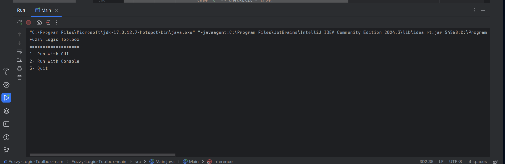

# Fuzzy Logic Toolbox

## Overview
The **Fuzzy Logic Toolbox** is a Java-based tool for designing, implementing, and testing fuzzy logic systems. It provides a user-friendly GUI for defining fuzzy sets, inference rules, and performing defuzzification.

## Features
- Intuitive **Graphical User Interface (GUI)** for managing fuzzy rules and variables.
- Supports **fuzzy inference systems** with multiple input and output variables.
- Provides **visualization tools** for understanding fuzzy set behavior.
- Includes **rule-based decision-making** for real-world applications.
- Outputs can be analyzed using **graphical representation**.

## Screenshots
### Main Menu


### GUI Menu


### Fuzzification Metod

)


### Fuzzy Logic Output


## Installation
1. Ensure you have **Java 8 or later** installed on your system.
2. Clone this repository:
   ```sh
   git clone https://github.com/AmrShams9/fuzzy-logic-toolbox.git
   ```
3. Navigate to the project directory:
   ```sh
   cd fuzzy-logic-toolbox
   ```
4. Compile the Java source code:
   ```sh
   javac -d bin src/*.java
   ```
5. Run the application:
   ```sh
   java -cp bin Main
   ```

## Usage
1. Launch the application.
2. Define input and output variables.
3. Set up fuzzy rules and membership functions.
4. Run simulations and analyze results.

## Requirements
- **Java 8+**
- **Java Swing** (if using GUI components)

## Contributing
Pull requests are welcome. For major changes, please open an issue first to discuss what you would like to change.

## License
This project is licensed under the MIT License - see the LICENSE file for details.
